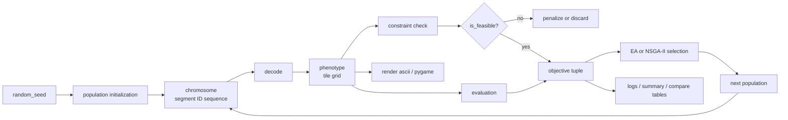
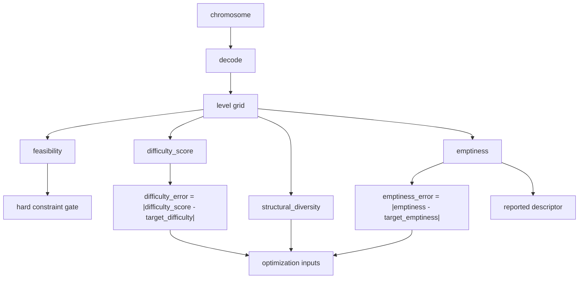

# Mario PCG Pipeline And Metric Map

## Purpose
This note gives one visual summary of the current Mario-like PCG baseline.

It is intended for:
- team alignment
- report drafting
- presentation explanation

## Pipeline

## Metric Assignment

## Interpretation
1. `random_seed` controls the random search trajectory, not the content semantics of a level.
2. `chromosome` is the EA search object.
3. `phenotype` is the decoded logical level layout.
4. `feasibility` is checked on phenotype and acts as a hard gate.
5. `difficulty_error` and `emptiness_error` are target-matching objectives.
6. `structural_diversity` is the variation objective.
7. `emptiness` is still reported, but no longer optimized directly.

## Algorithm Reading
### EA
- Uses a simplified scalarized survivor rule.
- Tends to compress toward one strong region.

### NSGA-II
- Uses Pareto non-dominated sorting.
- Uses crowding distance to keep the front spread out.
- Better suited for preserving trade-off solutions.
